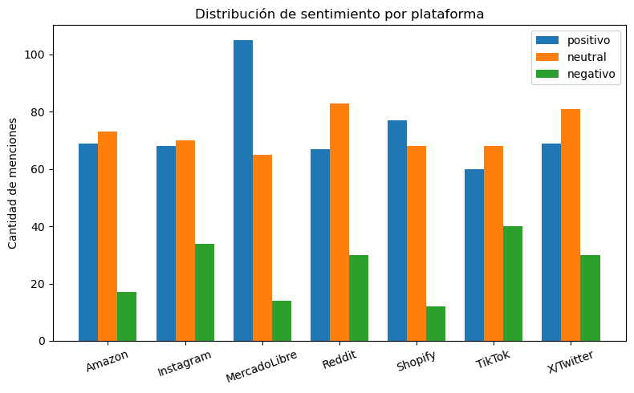
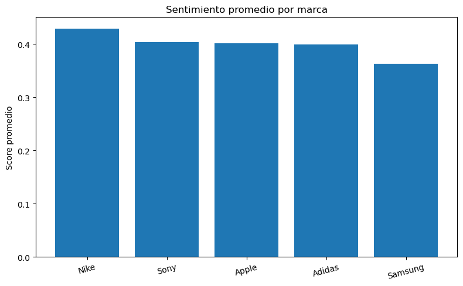
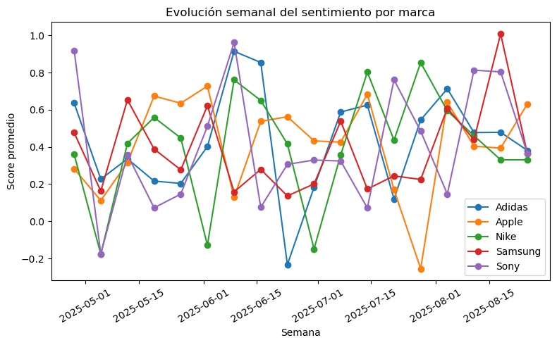

# Análisis de Sentimientos en Redes Sociales y Plataformas  

**Proyecto Final - Ingeniería de Big Data**  
**Grupo #3**  

## 📌 Introducción  
Este proyecto forma parte del trabajo final de la asignatura **Ingeniería de Big Data**, donde se implementa un análisis de sentimientos en publicaciones de redes sociales y plataformas digitales. El objetivo es demostrar el proceso completo de manipulación, análisis y visualización de datos no estructurados en un entorno de **Big Data Analytics**.  

## 🎯 Objetivos  
- Realizar un **análisis de sentimientos** a partir de publicaciones simuladas.  
- Preprocesar datos y generar un **dataset sintético** con texto y métricas asociadas.  
- Aplicar técnicas de **procesamiento de lenguaje natural (NLP)** para clasificar los sentimientos.  
- Implementar **visualizaciones** que permitan entender la distribución y patrones de los resultados.  

## 🛠️ Tecnologías Utilizadas  
- **Python**  
- **Pandas** para manejo de datos  
- **NLTK / TextBlob** para análisis de sentimientos  
- **Matplotlib / Seaborn** para visualización  
- **Jupyter Notebook** como entorno de desarrollo  

## 📊 Resultados Obtenidos - Visualizaciones
El análisis permitió identificar tendencias en las publicaciones:  
- Distribución de sentimientos **positivos, negativos y neutrales**.  
- Relación entre la cantidad de likes, comentarios y polaridad del sentimiento.  
- Visualizaciones claras que representan la frecuencia de palabras, histogramas de polaridad y diagramas comparativos de interacciones.  

### Distribución de Sentimiento por Plataforma

### Sentimiento Promedio por Marca

### Evolución Semanal del Sentimiento por Marca (Time Series)

